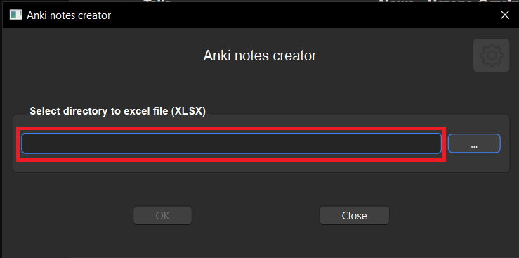
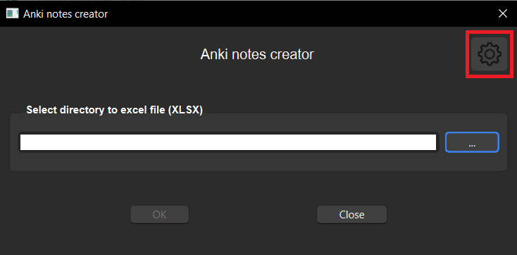
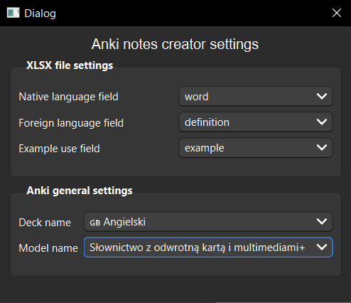
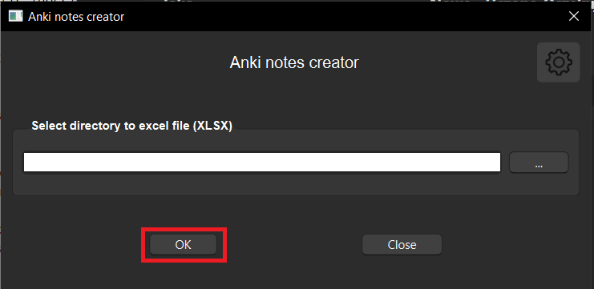

# anki-flashcards-creator
Application uses ANKI API client and ANKI library to create new flashcards on Anki web and make user available to create easily flashcards using list of words from a file.

## CLI
To generate new notes, user has to follow below steps:
1. copy content of [.env.example](./.env.example) file to `.env` file and fill with adequate content in the variables
2. run command prompt
3. create a new virtual environment 
`python -m venv venv`
4. activate virtual environment 
`"./venv/Scripts/activate"` - for windows
5. install build package 
`pip install build`
5. build app (being in the app directory)  
`python -m build`
6. activate app (being outside program directory) 
`python anki-flashcards-creator`

Script requires to parse to XLSX file with words. Script requires 3 columns to be read from Excel file. By default their names are: 
<li> <b>word</b> - word name in english
<li> <b>definition</b> - meaning of a word in polish
<li> <b>example</b> - example of a use of a word

User has to also have a predefined `deck` and `card model`. 

Deck name is predefined in [constants.py](./constants.py) in a variable `CURR_LANG`. By default it is **English**

Model name is defined in [constants.py](./constants.py) in a variable `MODEL_NAME`. By default it is: **Słownictwo z odwrotną kartą i multimediami**

If user doesn't know which parameters have to be in a card model, it is also presented below:
<li> <b>Słowo PL</b> - word in polish
<li> <b>FrontAudio</b> - audio with pronounciation of a word in english (at the front of a card)
<li> <b>Słowo EN</b> - word in english
<li> <b>BackAudio</b> - audio with pronounciation of a word in english (at the back of a card)
<li> <b>Obrazek</b> - image of a word
<li> <b>Audio</b> - audio with pronounciation of a word
<li> <b>Przykład EN</b> - example of a use of a word in english

Above parameters are also defined in [constants.py](./constants.py) in a variable `FIELDS` values. This is the place where it can be changed.

## GUI
To generate new notes, user has to follow below steps:

### 1. Select a path to an existing XLSX file 

### 2. Go to settings page

### 3. Adjust necessary parameters for creating an anki flashcard

In the new page there are few configurations to adjust. In order to create correct flashcards up to an add-on standard, user have to configure below parameters: 

#### Fields in XLSX file
-  **Native language field** (string) - field presented in the front page of a flashcard in a native language of a user (own choice)
-  **Foreign language field** (string) - field presented in the back page of a flashcard in a foreign language of a user (own choice)
- **Example use field** (string) - field representing example usage of a trained word 

#### Anki parameters
- **Deck name** - name of a deck in which a flashcard will be added.
- **Model name** - name of a model which represents a template of a flashcard. It has to consist of the words in [constants.py](./src/constants.py) in values of a parameter **FIELDS**.

### 4. Flashcards generation

After the above process is conducted, cards will be present in the deck cards pane.